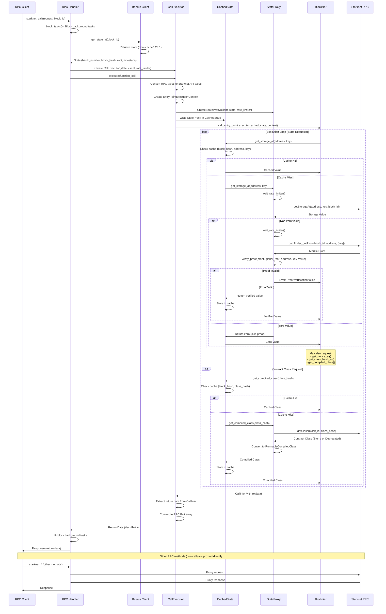

Beerus Architecture Overview
============================

## Components

### Core Client Library
* **Beerus Client** (`src/client.rs`)
  - Main client orchestrating state synchronization and RPC operations
  - State management (`src/client/state.rs`)
  - L1 range tracking (`src/client/l1_range.rs`)
  - Rate limiting (`src/client/rate_limiter.rs`)
  - HTTP client wrapper (`src/client/http.rs`)
  - Block hash validation (`src/client/block_hash.rs`)
  - Utility functions (`src/client/utils.rs`)

### RPC Server
* **RPC Server** (`src/rpc.rs`)
  - Based on `axum` HTTP server framework
  - RPC handler implementation (`src/rpc/handler.rs`)
  - RPC context management (`src/rpc/context.rs`)

### State Synchronization
* **Feeder Gateway Client** (`src/feeder.rs`)
  - Interfaces with Starknet Feeder Gateway for L2 block data
* **Background Loader** (`src/background_loader/`)
  - Background state synchronization (`src/background_loader/loader.rs`)
  - Async task blocking for consistency (`src/background_loader/async_blocker.rs`)
* **L1 (Ethereum) Client** (`src/eth/`)
  - Core contract interaction (`src/eth/core_contract.rs`)
  - Ethereum utilities (`src/eth/utils.rs`)

### Storage Layer
* **Storage Providers** (`src/storage/`)
  - Storage trait definition (`src/storage/storage_trait.rs`)
  - SQL storage provider (`src/storage/sql_storage_provider.rs`)
  - Mock storage provider for testing (`src/storage/mock_storage_provider.rs`)
  - WebAssembly storage provider (`src/storage/wasm_storage_provider.rs`)
  - Storage utilities (`src/storage/utils.rs`)

### Execution Engine
* **Stateless Execution** (`src/exe/mod.rs`)
  - Call executor (`src/exe/executor.rs`)
  - State proxy for blockifier (`src/exe/state_proxy.rs`)
  - Execution context creation (`src/exe/context.rs`)
  - Contract class loading (`src/exe/contract_loader.rs`)
  - State caching (`src/exe/cache.rs`)
  - Type mappings (`src/exe/map.rs`)
  - Error handling (`src/exe/err.rs`)
  - Dependencies:
    - `blockifier` - Starknet execution engine
    - `cairo-vm` - Cairo virtual machine
    - `cairo-lang-*` - Cairo language support

### Proof Verification
* **Merkle Proof Verification** (`src/proof.rs`)
  - Proof parser (`src/proof/parser.rs`)
  - Merkle tree operations (`src/proof/merkle.rs`)
  - Hash functions (`src/proof/hash.rs`)
  - Proof types (`src/proof/types.rs`)

### Configuration & Utilities
* **Configuration** (`src/config.rs`)
  - Server and client configuration management
* **Type Conversion** (`src/convert.rs`)
  - Conversions between RPC types and internal types
* **Utilities** (`src/util.rs`)
  - Retry logic and common utilities

## Execution

### Get current state

```mermaid
sequenceDiagram
Note right of Beerus: Beerus is ready
Beerus->>Feeder: Query State
Beerus->>Feeder: Get Latest Block
Feeder->>(Starknet RPC): Get Latest Block
(Starknet RPC)->>Feeder: Latest Block Number
Feeder->>Feeder: Verify received block
Feeder->>Beerus: Latest Block Number
Beerus->>Beerus: Store Current State
```

### State Synchronization

Beerus implements a dual-layer state synchronization mechanism that ensures both freshness and cryptographic verification of the Starknet L2 state.

#### L2 Gateway Synchronization

The L2 gateway synchronization is a background process that continuously monitors and synchronizes with the Starknet feeder gateway. This process runs in a loop and performs the following operations:

1. **Latest State Fetching**: Periodically queries the Starknet feeder gateway for the latest block information
2. **Sequential Block Verification**: For each missing block between the current tracked state and the latest gateway state, Beerus:
   - Fetches the block data from the gateway
   - Verifies the block hash using the parent block hash chain
   - Stores the verified state to persistent storage
3. **State Storage**: Each verified block state (block number, block hash, state root, timestamp) is persisted to the database for fast retrieval

This mechanism ensures that Beerus stays up-to-date with the latest Starknet blocks while maintaining a verified chain of states.

#### L1-Based State Verification

For on-demand state retrieval or when verifying historical states, Beerus uses L1 (Ethereum) event proofs to cryptographically verify L2 state. This provides trustless verification without relying solely on the L2 gateway.

The L1 verification process works as follows:

1. **L1 Range Resolution**: When a state at a specific block is requested:
   - Reads the L1 range from storage that covers the target L2 block number
   - Uses a bisection algorithm to find the minimal L1 range needed for verification
   - The algorithm iteratively narrows down L1 blocks until the range is small enough (max 500 L2 blocks)

2. **Parallel-Safe Locking**: To prevent redundant synchronization work:
   - Each L1 range has a dedicated mutex lock
   - Multiple concurrent requests for the same range will queue and reuse the result
   - After acquiring the lock, checks if the state was already synced by another task

3. **State Range Verification**: Once the minimal L1 range is identified:
   - Fetches all L2 blocks and state updates in the range in parallel (with rate limiting)
   - Validates each block hash using the state update data
   - Verifies the parent hash chain forms a contiguous sequence
   - Ensures the final block hash matches the expected end state
   - Stores all intermediate verified states to storage

4. **L1 State Updates**: Periodically (configurable interval), Beerus:
   - Fetches the latest L1 state from Ethereum
   - Verifies that the stored L2 state matches the L1-verified state
   - Updates the latest L1 range tracking information

This dual approach ensures both real-time synchronization (via L2 gateway) and cryptographic verification (via L1 proofs) for maximum security and reliability.

#### L2 Gateway Synchronization Flow

```mermaid
sequenceDiagram
loop Background Sync Loop
    Beerus->>Feeder Gateway: get_latest_gateway_state()
    Feeder Gateway->>(Starknet RPC): Get Latest Block
    (Starknet RPC)->>Feeder Gateway: Latest Block Info
    Feeder Gateway->>Beerus: Latest Gateway State

    loop For each missing block
        Beerus->>Feeder Gateway: get_gateway_state(block_number)
        Feeder Gateway->>Beerus: Block Data
        Beerus->>Beerus: get_verified_state(block_hash, parent_hash)
        Beerus->>Beerus: Verify block hash chain
        Beerus->>Storage: write_state(verified_state)
    end

    Note over Beerus: Periodic L1 verification
    alt L1 sync interval elapsed
        Beerus->>L1 (Ethereum): get_l1_state()
        L1 (Ethereum)->>Beerus: Latest L1 State
        Beerus->>Storage: read_state(l1_state.block_number)
        Beerus->>Beerus: Verify stored state matches L1 state
        Beerus->>Storage: store_latest_l1_range(l1_state)
    end
end
```

#### L1-Based State Verification Flow

```mermaid
sequenceDiagram
participant RPC as RPC Request
participant Client as Beerus Client
participant Storage as Storage
participant L1 as L1 (Ethereum)
participant Gateway as Feeder Gateway

RPC->>Client: get_state_at(block_id)
Client->>Storage: read_state(block_number)
alt State not in storage
    Client->>Storage: read_l1_range(block_number)
    Storage->>Client: L1 Range

    Note over Client: Acquire lock for L1 range
    Client->>Client: Get/Create mutex for L1 range
    Client->>Client: Acquire lock (wait if needed)

    alt State synced during lock wait
        Client->>Storage: read_state(block_number)
        Storage->>Client: Verified State
    else Need to sync
        Note over Client: L1 Range Bisection
        loop Until range <= 500 L2 blocks
            Client->>L1: get_l1_state_updates(l1_start, l1_end)
            L1->>Client: State Updates
            Client->>Client: Find sub-range containing target block
            Client->>Storage: Store discovered sub-ranges
        end

        Client->>L1: get_state_on_block(l1_block)
        L1->>Client: End State (L1 verified)

        Client->>Gateway: get_gateway_state(block_number)
        Gateway->>Client: Gateway State
        Client->>Client: get_verified_state(block_hash)

        Note over Client: Verify State Range
        Client->>Client: Collect block IDs in range
        par Parallel fetch
            Client->>(Starknet RPC): getBlockWithReceipts(block_id)
            Client->>(Starknet RPC): getStateUpdate(block_id)
        end
        Client->>Client: Validate block hashes
        Client->>Client: Verify parent hash chain
        Client->>Client: Verify final block hash matches

        Client->>Storage: write_state(verified_states)
    end
end
Storage->>Client: Verified State
Client->>RPC: State
```

### Stateless call (RPC)

Beerus implements stateless execution of Starknet function calls using the `blockifier` execution engine. This allows executing calls against any historical or current block state without maintaining a full node's state database.

#### Execution Flow

When a `starknet_call` RPC request is received:

1. **Request Handling & State Retrieval**:
   - The RPC handler receives the function call request with a target block identifier
   - All background tasks are blocked to ensure consistent state during execution
   - The client retrieves the state at the requested block (using either cached state, L2 gateway sync, or L1 verification as needed)

2. **CallExecutor Setup**:
   - A `CallExecutor` is created with the retrieved state, blocking HTTP client, and rate limiter
   - The function call parameters (contract address, entry point selector, calldata) are converted from RPC types to Starknet API types
   - An execution context is created with the block number and timestamp from the state

3. **StateProxy Implementation**:
   - A `StateProxy` wraps the RPC client and implements the `blockifier` `StateReader` and `State` interfaces
   - This allows blockifier to request state data (storage, nonces, class hashes, contract classes) through the proxy
   - The proxy translates blockifier's state requests into RPC calls to the Starknet RPC endpoint

4. **Caching Layer**:
   - A `CachedState` wrapper provides LRU caching for frequently accessed state:
     - **Storage values**: Cached by (block_hash, contract_address, storage_key) with 1024 entry capacity
     - **Class hashes**: Cached by (block_hash, contract_address) with 256 entry capacity
     - **Contract classes**: Cached by (block_hash, class_hash) with 256 entry capacity
   - Cache hits avoid redundant RPC calls and proof verifications

5. **State Access & Proof Verification**:
   - For each state access during execution:
     - First checks the cache; if found, returns immediately
     - If not cached, makes an RPC call to fetch the state value
     - For non-zero storage values, fetches a Merkle proof from the RPC endpoint
     - Verifies the Merkle proof against the global state root from the block state
     - Caches the verified value for future use
     - Returns the value to blockifier

6. **Blockifier Execution**:
   - Blockifier executes the function call using the state proxy
   - During execution, blockifier may request:
     - Storage values at specific keys
     - Contract nonces
     - Class hashes for contracts
     - Compiled contract classes (Sierra or deprecated Cairo 0)
   - Each request triggers the state proxy's verification flow
   - The execution runs with maximum gas limit and proper execution mode

7. **Response Generation**:
   - After execution completes, the return data is extracted from the `CallInfo`
   - Return values are converted from Starknet API types back to RPC types (Felt array)
   - The response is returned to the RPC client

#### Key Features

- **Stateless**: No local state database required; all state is fetched on-demand via RPC
- **Cryptographically Verified**: Every non-zero storage value is verified using Merkle proofs
- **Cached**: LRU caches reduce redundant RPC calls and proof verifications
- **Rate Limited**: All RPC calls respect rate limits to avoid overwhelming the endpoint
- **Block-Accurate**: Executes against the exact state of the requested block

#### Stateless Call Execution Flow


